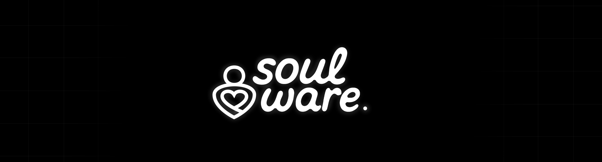

# FECAP - Fundação de Comércio Álvares Penteado

# Nome do projeto: Instituto alma website

## Nome do grupo: Soulware

## Integrantes: <a href="https://www.linkedin.com/in/victor-cmrg/">Victor Camargo</a>, <a href="https://www.linkedin.com/in/nicolasnitta/">Nicolas Hayato Nitta</a>, <a href="https://www.linkedin.com/in/nelsonreisgomes/">Nelson dos Reis Gomes Souza</a>, <a href="https://www.linkedin.com/in/karine-aparecida-cardoso-alves-b903a2366/">Karine Aparecida Cardoso Alves</a>

## Professores Orientadores: <a href="https://www.linkedin.com/in/victorbarq/">Dr. Victor Von Doom</a>, <a href="https://www.linkedin.com/in/victorbarq/">Me. Saitama</a>, <a href="https://www.linkedin.com/in/victorbarq/">Dr. Strange</a>, <a href="https://www.linkedin.com/in/victorbarq/">Me. Yoda</a>, <a href="https://www.linkedin.com/in/victorbarq/">Dr. Gero</a>

## Descrição

  Game by <a href="http://www.nyphotographic.com/">Nick Youngson</a> <a rel="license" href="https://creativecommons.org/licenses/by-sa/3.0/">CC BY-SA 3.0</a> <a href="http://pix4free.org/">Pix4free</a>

O projeto consiste em uma homepage institucional para o Instituto Alma, uma organização sem fins lucrativos dedicada a ajudar pessoas em situação de vulnerabilidade social. O objetivo da página é apresentar a missão, os valores e as iniciativas do instituto, transmitindo confiança e engajamento para que mais pessoas conheçam o trabalho realizado.
  
Além de informar, a plataforma oferece funcionalidades para que qualquer pessoa possa se voluntariar ou realizar doações de forma simples e segura, incentivando a participação ativa na transformação social. A proposta é criar uma experiência intuitiva e acolhedora, conectando doadores, voluntários e o instituto em prol de um objetivo comum: melhorar a vida de quem mais precisa.

## 🛠 Estrutura de pastas

-Raiz 
| 
|-->documentos 
  &emsp;|-->antigos 
  &emsp;|Documentação.docx 
|-->executáveis 
  &emsp;|-->windows 
  &emsp;|-->android 
  &emsp;|-->HTML 
|-->imagens 
|-->src 
  &emsp;|-->Backend 
  &emsp;|-->Frontend 
|readme.md 

A pasta raiz contem dois arquivos que devem ser alterados:

<b>README.MD</b>: Arquivo que serve como guia e explicação geral sobre seu projeto. O mesmo que você está lendo agora.

Há também 4 pastas que seguem da seguinte forma:

<b>documentos</b>: Toda a documentação estará nesta pasta.

<b>executáveis</b>: Binários e executáveis do projeto devem estar nesta pasta.

<b>imagens</b>: Imagens do sistema

<b>src</b>: Pasta que contém o código fonte.

## 🎓 Referências

Aqui estão as referências usadas no projeto.

1. [Casa do zezinho](https://casadozezinho.org.br)
2. [Fundação tênis](https://www.fundacaotenis.org.br)
